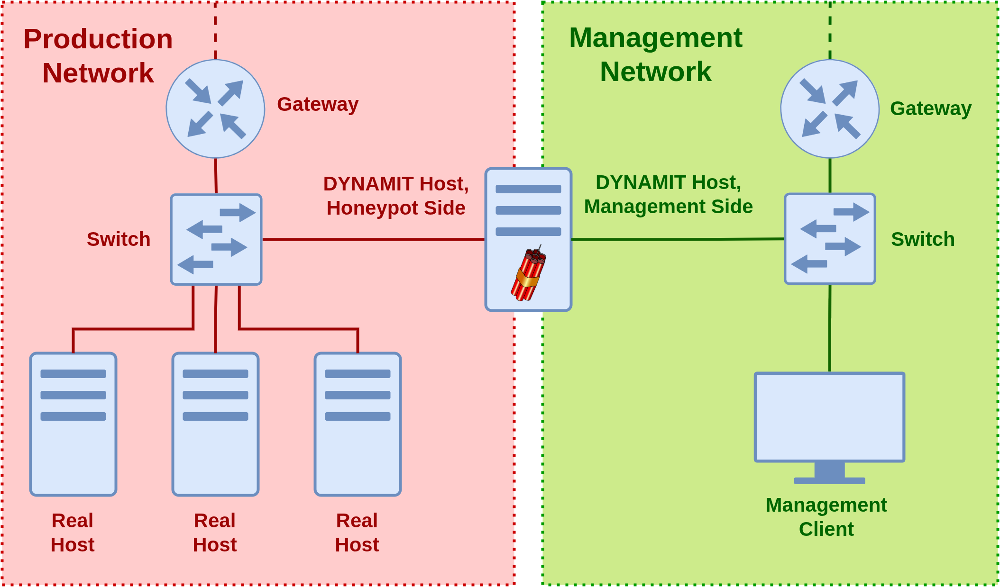
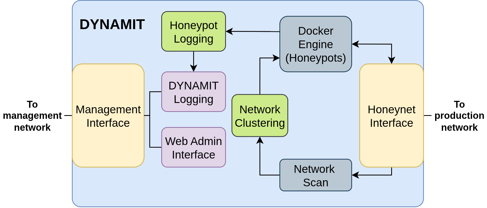
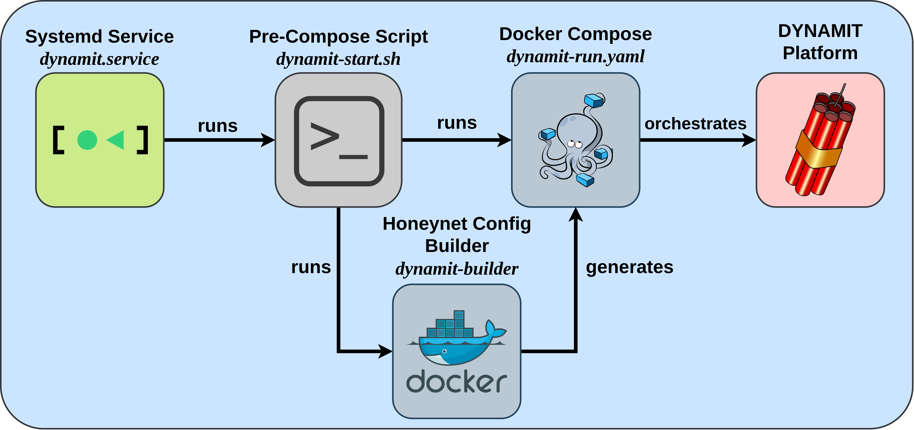
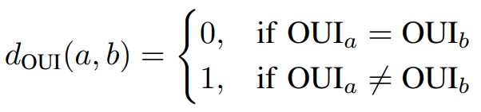
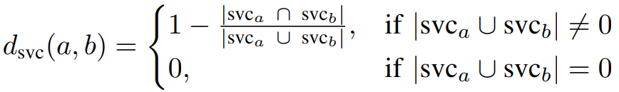
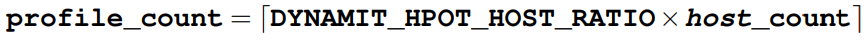
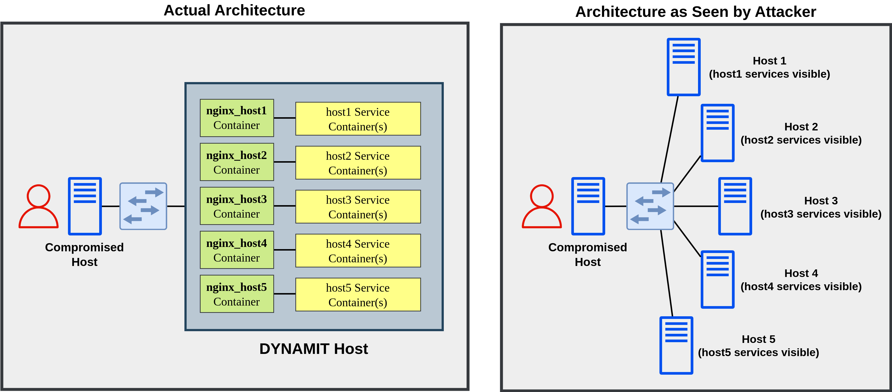
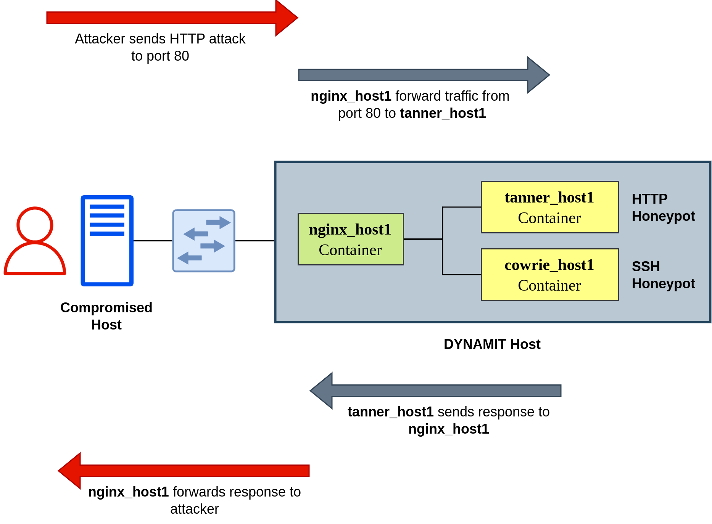

# DYNAMIT - Dynamic Honeypot Implementation Based on T-Pot

## 1. What is DYNAMIT?
  **DYNAMIT** is an orchestration system capable of automatically deploying multiple honeypot profiles within a single host, where each profile is tailored to blend in with the network deployment, making them look more convincing targets for attacker. Each honeypot profiles emulates a physical host, each with their own MAC address, IP address, exposed ports, and active services. The implementation paper for this project can be read [here](doc/paper.pdf).
  
  Taxonomy-wise, DYNAMIT is a: 
  - **Production Honeypot**: This honeypot system is designed to be deployed inside a production network in order to deceive attackers that have managed to infiltrate one's internal network, thus network administrator will be alerted for intrusion when the attacker is probing the honeypot. 

  - **Low-to-Medium Interaction Honeypot**: This honeypot system uses various low and medium interaction honeypot solution, in order to reduce resource usage, risk of compromise, and maintenance effort, while also providing decent enough deception capability. Specifically, it uses Snare-Tanner, Cowrie, and qeeqbox-honeypots

  - **Passive Honeypot**: This honeypot system does not actively engage with the attacker, but merely waits until they attempts an intrusion.
  - **Heterogenous Honeypot**: This honeypot system uses various type of honeypot solutions rather than just a single type.
  - **Dynamic Honeypot** : The main focus of its development, this honeypot system can dynamically adapt to its deployed network characteristics, including any change or modification that may occur.

## 2. Difference with [T-Pot](https://github.com/telekom-security/tpotce)
  - Taxonomy-wise, T-Pot is a **research**, **static honeypot**. 
    - It being a research honeypot means that its use-case is more focused on **studying and analyzing** a broader scope of attacks and exploits, rather than network protection via deception. 
    - It being a static honeypot means that it **cannot dynamically adapt** to its deployed network characteristics, as T-Pot only offers fixed sets of honeypot configuration.

  - Each T-Pot (Sensor) instance only emulates a **single physical host** with diverse range of services, contrasted with DYNAMIT's capability to emulate **multiple physical hosts** within a single instance.

## 3. How It Works
  ### 3.1. Deployment Topology 
  
  - Two networks, **Production Network** and **Management Network**

  - **Production network** consists of real hosts, as potential targets for attacker
  - **Management network** consists of management client, where network administrator would monitor the overall organization network
  - **DYNAMIT host**, which needs to have at least __2 NIC__, will be placed in **both production network and management network**
  - DYNAMIT honeypot profiles will be deployed to production network side, while DYNAMIT monitoring dashboard will be deployed to management network
  - DYNAMIT production network will be isolated in a way such that potential attackers would only be able to see the deployed honeypot profiles. From production network side, attacker cannot detect, access, or reach the DYNAMIT host itself nor the DYNAMIT monitoring dashboard. 

  ### 3.2. Information Flow
  
  ### 3.3. Orchestration Flow
  
  - After installation, a systemd service called `dynamit.service` will run at every boot.

  - dynamit.service will run a pre-compose script called `dynamit-start.sh`, and will decide whether to rebuild honeypot profile configuration or not (based on last rebuild time).
  - If it decides to rebuild, dynamit-start.sh will run a docker container called `dynamit-builder`.
  - `dynamit-builder` consists of a Python script which will perform **network scan, network clustering, profile generation, and profile deployment**, resulting in a Docker Compose file called `dynamit-run.yaml`, which specifies the necessary containers in order to deploy the honeypot profile in the production network.
  - After `dynamit-builder` is finished (or if `dynamit-start.sh` decides not to rebuild), `dynamit-start.sh` will run `dynamit-run.yaml` Compose file, after which the honeypot profiles will be visible from the production network, and management web interface accessible from management network.

  ### 3.4. Network Scanning
  - Performed using Nmap command: `nmap -n -sS -p- -sV -T4 <prod_ip>`

    - `-n` to ignore reverse DNS resolution, an irrelevant process in our local network scan

    - `-sS` to perform standard TCP port scan
    - `-p-` to perform scan on all TCP port (1-65535)
    - `-sV` to perform service fingerprinting, in order to learn what type of service is running on scanned host
    - `-T4` to set the scanning speed to aggressive, recommended for LAN scanning
    - `<prod_ip>`: network address for production network (ie: `192.168.1.0/24`)
  - From the scan result, DYNAMIT obtains the IP address, MAC address, exposed TCP ports, and list of services of all hosts present inside production network

  ### 3.5. Network Clustering
  - The result of network scan are used for network clustering

  - Clustering based on two host features: 
    - **OUI** (first 3 bytes of MAC address that identifies NIC manufacturer) to identify similarity based on hardware
    - **List of services** to identify similarity based on software
  - Difference or distance between two hosts, based on **OUI feature**, is quantified using **Manhattan distance**
  

  - Difference or distance between two hosts, based on **list of services**, is quantified using **Jaccard distance**
  

  - Total distance between two hosts is the **average of OUI distance and list-of-service distance**
  - For clustering algorithm, **K-Medoids is used** for its similarity with K-Means used by implementations that inspired this project
  - However, a significant drawback of K-Medoids is its inability to find optimal number of cluster. As workaround, **heuristic-based threshold is used** in order to find optimal number of cluster using K-Medoids
  ### Profile Generation
  - Clustering results are then used as basis for honeypot profile generation

  - Amount of honeypot profile to be deployed is calculated using the following formula, where `DYNAMIT_HPOT_HOST_RATIO` is defined in `.env_dynamit` file, with a default value of 0.3.
  
  - For each profile to be deployed,
    - Randomly choose an existing host from the largest cluster as base profile
    - For the purpose of profile generation, the effective size of largest cluster is reduced to half (while its actual member count remains the same), in order to ensure better distribution across cluster
    - From the base profile, IP address and last 3 bytes of MAC address are mutated, as their value must be unique inside the production network. Meanwhile, the OUI and list of services are kept exactly the same as base profile
  ### 3.6. Profile Deployment
  - `dynamit-builder` will then constructs a customized Docker Compose file in order to emulate the result of profile generation process 

  - Uses same security practice as T-Pot's: read-only, non-root container with whitelisted kernel capabilities
  - Compose file built from a template (only containing DYNAMIT's management-side container)
  - For each profile to be deployed:
    - Add NGINX container along with a set of honeypot service containers
    - For NGINX, they are assigned IP and MAC address according to the generated profile specification, and connect them to MACVLAN-enabled production-side NIC in order to make them externally-reachable. Because of that, NGINX will emulate the network stack of each honeypot profiles
    - For service containers, DYNAMIT supports emulation of 5 services: HTTP (using Snare-Tanner), SSH (using Cowrie), SMB, RDP, and VNC (last three using qeeqbox-honeypots). For each DYNAMIT-supported service specified in the honeypot profile, DYNAMIT will deploy a corresponding honeypot service container. Because of that, these service containers will emulate software/service stack of each honeypots profile
    - If service is unsupported, DYNAMIT will leave the corresponding port open, but does not bind any service into it
    - Different profile will use different honeypot service container, even if they specify the same service. 
    - Each service containers are connected to per-profile Docker internal network, enabling inter-container communication with the corrresponding NGINX instance
    - Overall, each honeypot profile will create an illusion that a single network host (NGINX container) is running multiple services (honeypot service containers)
  ### 3.7. DYNAMIT from Attacker's perspective
  
  - An attacker interacting with the system will perceive these honeypot profiles as distinct physical hosts, each running its own services.
  - DYNAMIT host itself is rendered invisible from attacker's perspective, as production-side NIC is left without an assigned IP address, and ARP packets blocked to prevent identification
  - Meanwhile, the each honeypot profiles uses its own MACVLAN interface that "hijacks" DYNAMIT host's physical production-side NIC, in order to send out packets with its own MACVLAN-configured MAC and IP address
  ### 3.8. DYNAMIT Attack Flow
  
  ### 3.9. Routine Honeypot Re-deployment
  - DYNAMIT is configured to rebuild its honeypot profiles once every week, in order to ensure that its profiles can keep up with any changes that might occur within the network
  - This interval is currently still hardcoded inside the dynamit-builder's Python script
  - The next-build-time is defined in `.env_dynamit` files

## 4. Getting Started
### 4.1. Preparation
  - DYNAMIT **CANNOT be installed in cloud environment** due to inherent limitations with MACVLAN. 
    - Wired interface in such environment simply won't be detected as MACVLAN-capable interface in the install script.

  - DYNAMIT needs to be installed on machine with **two NICs**. One connected to management network for administrative purpose. The other connected to production network, where attacker is expected to come from. 
    - In practice, as the install script only asks for network interface connected to production network, machine with just one NIC will not fail the install process, although you might not be able to access the DYNAMIT's management interface.

  - For **production network NIC, wireless NIC are not supported** as they cannot support MACVLAN driver, and won't be detected as MACVLAN-capable interface in the install script. 
    - For management network NIC, such restriction does not apply.

  - **Production network needs to be filled with a number of actual hosts** (minimum 1 host other than DYNAMIT host), since DYNAMIT relies on network clustering to generate honeypot profiles. 
    - If network only consists of DYNAMIT host, install script will fail, as the test to find MACVLAN-capable interface relies upon communication with network peers.

  - **Ensure that production network NIC has already been configured**, as the installer assumes the interface is already running and capable of communicating with network peers

## 4.2. Install Instruction
  - Run `git clone https://github.com/zaki-ananda/dynamit` at `/home/<user>` directory

  - Run `cd dynamit && ./install_dynamit.sh`
  - The install script will search for MACVLAN-capable interface
    - Gotchas
  - Install script will then automatically executes Ansible Playbook. Notably, it will set up a systemd service to automatically run DYNAMIT after boot
  - After that, it will ask for Web Username and Password. This is used to access Web Admin Page of DYNAMIT
  - Install script will then automatically build the dynamit-builder container, which will later be used to execute DYNAMIT orchestration flow
  - Reboot DYNAMIT host
  - Login to DYNAMIT web admin page (from management network) at `https://<dynamit-ip-for-management-network>:64297` and go to Kibana page. Export `dynamit/dashboard.ndjson`. This will add DYNAMIT's custom dashboard for Kibana
  - If access via SSH is necessary, you can access DYNAMIT host at port 64295.
  - You can start and stop DYNAMIT with the command `sudo systemctl start dynamit` and `sudo systemctl stop dynamit`

# 5. Credit and Thanks
  - Yan Maraden, S.T., M.T., M.Sc as Thesis Supervisor
  - Prof. Dr. Ir. Riri Fitri Sari, M.M., MSc as Thesis Examiner
  - I Gde Dharma Nugraha, S.T., M.T., Ph.D as Thesis Examiner
  - Deutsche Telekom Security GmbH and the original [T-Pot](https://github.com/telekom-security/tpotce) Team whose software is the basis for this project
  - The developers and development communities of
    * [cowrie](https://github.com/cowrie/cowrie/graphs/contributors),
[docker](https://github.com/docker/docker/graphs/contributors),
[elasticsearch](https://github.com/elastic/elasticsearch/graphs/contributors),
[elasticvue](https://github.com/cars10/elasticvue/graphs/contributors),
[fatt](https://github.com/0x4D31/fatt/graphs/contributors),
[honeypots](https://github.com/qeeqbox/honeypots/graphs/contributors),
[kibana](https://github.com/elastic/kibana/graphs/contributors),
[logstash](https://github.com/elastic/logstash/graphs/contributors),
[p0f](http://lcamtuf.coredump.cx/p0f3/),
[snare](https://github.com/mushorg/snare/graphs/contributors),
[tanner](https://github.com/mushorg/tanner/graphs/contributors),
[suricata](https://github.com/OISF/suricata/graphs/contributors)
  - The following company and organization
    * [docker](https://www.docker.com/),
[elastic.io](https://www.elastic.co/),
[honeynet project](https://www.honeynet.org/)
  - [Fraunholz et al.](https://arxiv.org/abs/2111.03884), [Zhang et al.](https://dl.acm.org/doi/10.1145/3617184.3618056), [Bartwal et al.](https://ieeexplore.ieee.org/document/9888808), and [Song et al.](https://ieeexplore.ieee.org/document/8038436) whose research paper was the inspiration for this project

# 7. Licenses
The software that DYNAMIT is built on uses the following licenses.
 GPLv2:
[suricata](https://suricata.io/features/open-source/)
 GPLv3:
[fatt](https://github.com/0x4D31/fatt/blob/master/LICENSE),
[snare](https://github.com/mushorg/snare/blob/master/LICENSE),
[tanner](https://github.com/mushorg/snare/blob/master/LICENSE),
[tpot](https://github.com/telekom-security/tpotce)
 Apache 2 License:
[cyberchef](https://github.com/gchq/CyberChef/blob/master/LICENSE),
[elasticsearch](https://github.com/elasticsearch/elasticsearch/blob/master/LICENSE.txt),
[logstash](https://github.com/elasticsearch/logstash/blob/master/LICENSE.txt),
[kibana](https://github.com/elasticsearch/kibana/blob/master/LICENSE.txt),
[docker](https://github.com/docker/docker/blob/master/LICENSE)
 MIT license:
[autoheal](https://github.com/willfarrell/docker-autoheal?tab=MIT-1-ov-file#readme),
[elasticvue](https://github.com/cars10/elasticvue/blob/master/LICENSE),
 Other:
[cowrie](https://github.com/cowrie/cowrie/blob/master/LICENSE.rst),
[Elastic License](https://www.elastic.co/licensing/elastic-license),
 AGPL-3.0:
[honeypots](https://github.com/qeeqbox/honeypots/blob/main/LICENSE)
  

As DYNAMIT is forked from [T-Pot](https://github.com/telekom-security/tpotce), this project is thus licensed under **GNU General Public License Version 3.0 (GPL-3.0)**.
